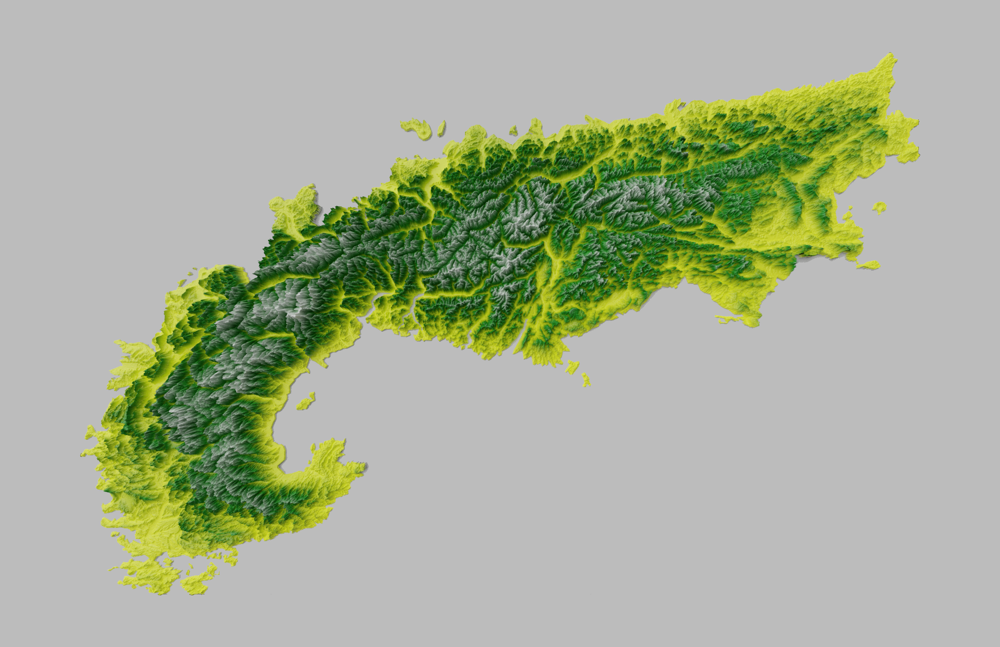
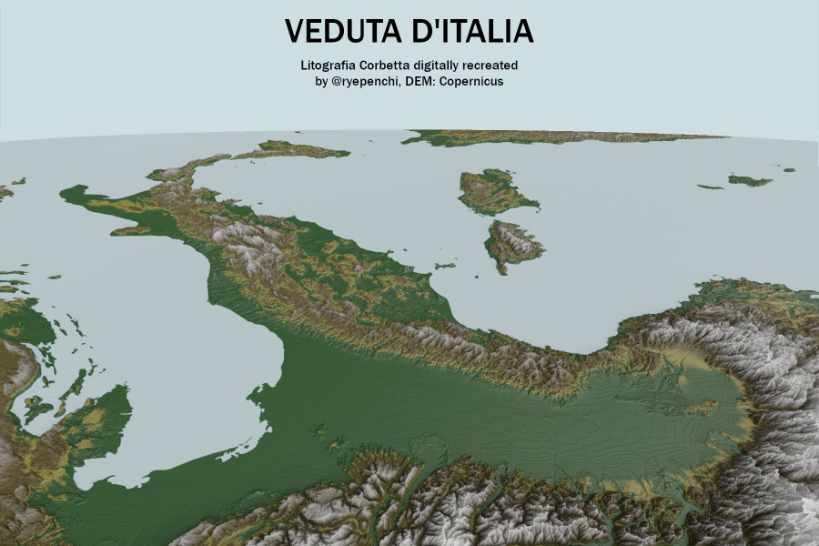
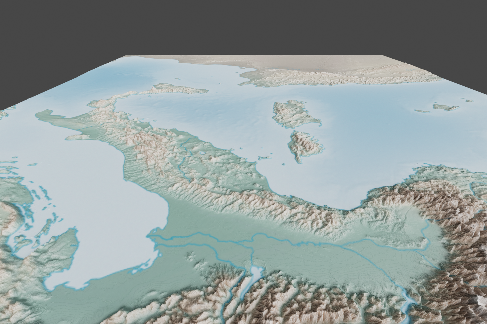

# Geoblender experiments & comments
[@JoeWDavies](https://github.com/JoeWDavies) Geoblender [Tutorial](https://github.com/JoeWDavies/geoblender)

[Copernicus Elevation data](https://ec.europa.eu/eurostat/web/gisco/geodata/reference-data/elevation/copernicus-dem/elevation)

## 1st try, render of the alps
Using a simplified boundary for the Alps as published by the European Environmental Agency [link](https://www.eea.europa.eu/data-and-maps/data/european-mountain-areas/)

___
## 2nd go: recreation of the "[Litografia Corbetta](https://journals.openedition.org/paysage/docannexe/image/338/img-1.jpg)" (1853) view of Italy from an Austrian viewpoint

| 1st try | 2nd try |
| :-: | :-: |
| sticking with a pretty traditional color palette | using [NaturalEarthData](https://www.naturalearthdata.com/downloads/10m-raster-data/10m-cross-blend-hypso/) Cross-blended hypsometric tints for coloring |
|  |  |